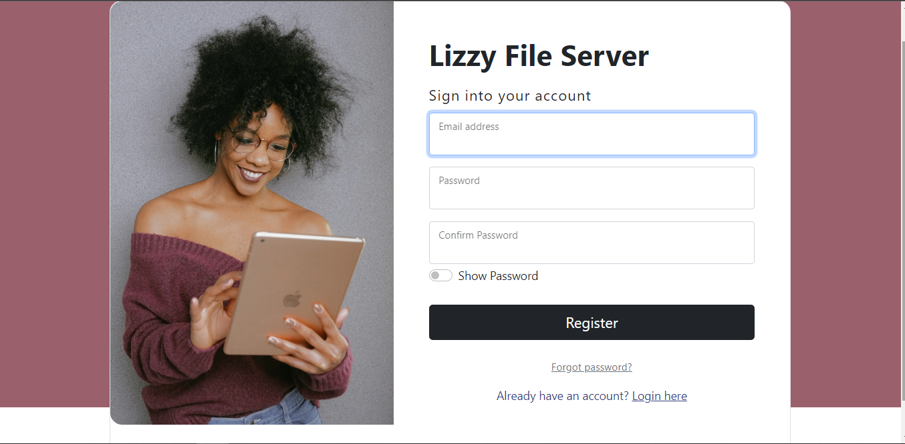

# FILE SERVER PROJECT

This is a file server project to enable the owner to share files

## Installation

To install the project, you need to have Python 3 and pip installed on your system. Then, follow these steps:

- Clone this repository: `https://github.com/Kjeff24/FileServer.git`
- Create a virtual environment: `python -m venv venv`
- Activate the virtual environment: `source venv/bin/activate` (on Linux/Mac) or `venv\Scripts\activate` (on Windows)
- Install the required dependencies: `pip install -r requirements.txt`

## Usage

To run the project, you need to set your email and password. You can use a `.env` file to store them. For example:

```
EMAIL_FROM_USER = 'your email'
EMAIL_HOST_USER = 'your email'
EMAIL_HOST_PASSWORD = 'your email password'
```

Then, you can run the following commands:

- Run the app: `python manage.py runserver`

By default the development server will start at http://127.0.0.1:8000/


## Models
The project provides the following models:
### User

#### Fields
- is_email_verified
- email

### File

#### Fields
- title
- description
- file_type
- file
- downloads
- emails_sent

#### Functions
- downloads_count()
- emails_sent_count()


## Views
### homepage
- home
- downloadFile
- emailFile

### user_management
- end_activation_email
- signupPage
- loginPage
- logoutUser
- activate_user

## Endpoints

The project provides the following endpoints:

- ` `: homepage
- `admin/`: Django admin
- `signup/`: signup page
- `login/`: login page
- `logout/`: logout user
- `activate-user/<uidb64>/<token>`: account activation
- `file/<int:pk>/download/`: download file
- `file/<int:pk>/send_email/`: email file
- `reset_password/`: password reset
- `reset_password_sent/`: password reset sent
- `reset/<uidb64>/<token>/`: password reset form
- `reset_password_complete/`: password reset done


## Preview

### home


### home (not logged in)


### login


### signup


### password reset


### password reset sent


### password reset form


### password reset complete


### page unavailable
